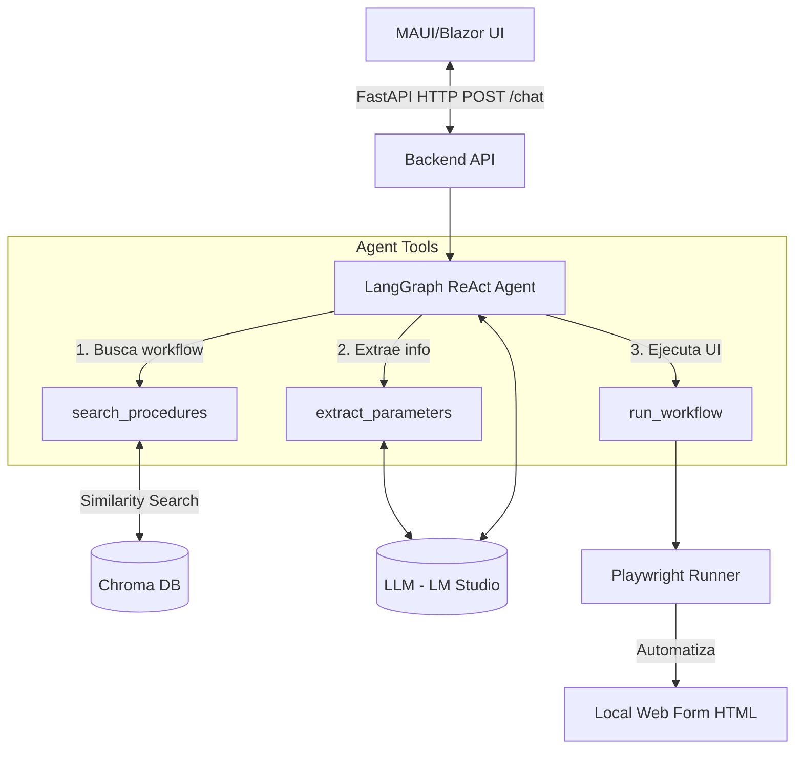

# 🤖 Agente Autónomo RPA + RAG (LangGraph + MAUI)

Este proyecto es una solución end-to-end que implementa un agente conversacional inteligente capaz de orquestar automatizaciones web (RPA) basándose en procedimientos indexados mediante un sistema RAG.

## 🏗️ Arquitectura del Sistema

El proyecto se divide en dos componentes principales:
1. **RPA_Agent_API (Backend / Python)**: Contiene el servidor FastAPI, el Agente React construido con LangGraph, el buscador RAG con ChromaDB y el ejecutor RPA usando Playwright.
2. **RPA_Agent_UI (Frontend / MAUI Blazor)**: Aplicación cliente multiplataforma que se comunica con la API para exponer el chat del agente al usuario final.

### Diagrama de Arquitectura Simplificado



### 🧠 Justificación de LangGraph

Para la construcción del agente se ha elegido **LangGraph** (`create_react_agent`) en lugar de LangChain clásico. La justificación técnica es:
- **Gestión de Estado Robusta**: LangGraph permite mantener el historial y el estado intermedio de las invocaciones de herramientas mediante `MemorySaver`, lo que facilita un flujo conversacional multi-turno real.
- **Flujos Controlados**: Nos otorga mayor granularidad a la hora de estructurar nodos y condicionales (en el futuro, para flujos como pedir confirmación al usuario antes de ejecutar el RPA).
- **Tool Calling Nativo**: Se adapta perfectamente al estándar actual de invocación de herramientas impulsado por OpenAI, permitiendo que el Agente "razone" qué herramientas llamar, en qué orden y con qué parámetros.

## 🚀 Requisitos Previos

- Python 3.11+
- LM Studio instalado y corriendo localmente (puerto `1234`). Se recomienda usar un modelo ligero como *gemma-2-9b* o *qwen*. Habilitar CORS y API Server.
- .NET 8 SDK (para la interfaz MAUI Blazor).

## ⚙️ Instalación y Uso

### 1. Servidor del Formulario Local (Web Form)
Abre una terminal y levanta el servidor que contiene el formulario:
```bash
cd RPA_Agent_API/web_form
python server.py
```
El formulario y el grabador (Recorder JS) estarán disponibles en `http://localhost:8081`.

### 2. Backend del Agente (FastAPI)
Abre otra terminal, activa tu entorno virtual y levanta la API:
```bash
cd RPA_Agent_API
pip install -r requirements.txt # si no se han instalado las dependencias
python -m uvicorn api:app --reload --port 8000
```
La API quedará escuchando en `http://localhost:8000/chat`.

### 3. Interfaz Gráfica (MAUI)
Abre el proyecto `RPA_Agent_UI` en Visual Studio e inicia el proyecto, o compila vía CLI:
```bash
cd RPA_Agent_UI
dotnet run -f net8.0-windows10.0.19041.0
```
*(Asegúrate de ajustar el framework target según tu plataforma).*

---

## 🛠️ Herramientas Implementadas (Tools)

- `search_procedures`: Busca en ChromaDB el workflow más adecuado según la solicitud en lenguaje natural del usuario.
- `extract_parameters`: Usa el LLM para parsear la intención del usuario y convertirla en un JSON que coincida con el `param_schema` del workflow.
- `run_workflow`: Emplea Playwright para rellenar los datos en la web destino de manera autónoma.
- `list_procedures`: Herramienta de apoyo para orientar al agente cuando la petición es vaga.

## 📝 Mejoras Implementadas

* **Agente utilizando LangGraph**: Se cumple la mejora obligatoria (punto 9) estructurando el agente ReAct con `create_react_agent` y uso de Memory.
* **API FastAPI (Punto 7)**: Se ha desacoplado el agente en un microservicio al que se puede consultar mediante peticiones POST.
* **Interfaz MAUI/Blazor (Punto 6)**: El usuario interactúa a través de una UI moderna conectada al backend del agente.
